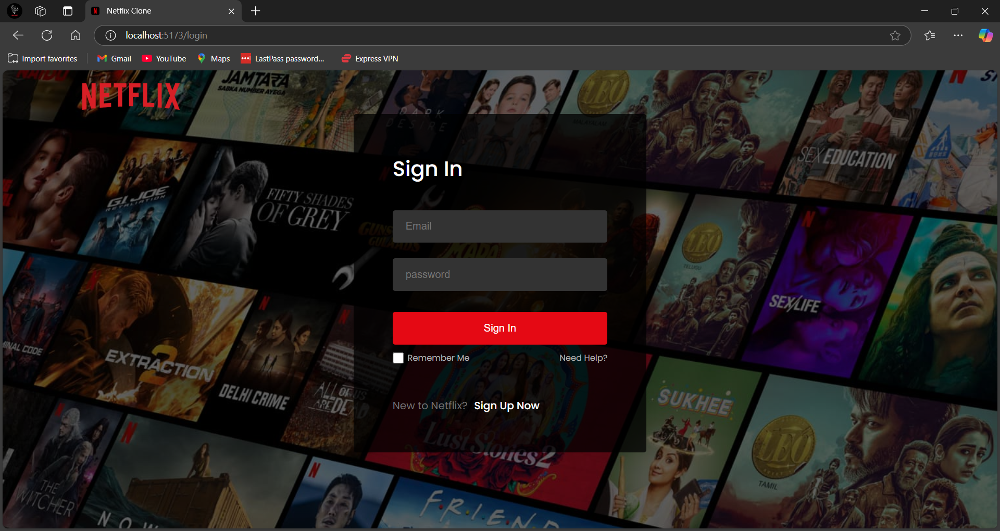
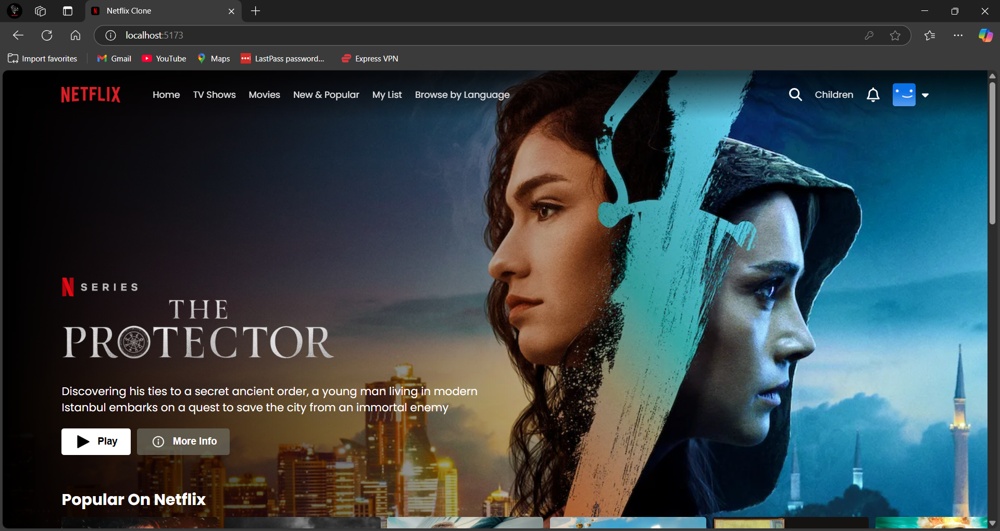

🎬 Netflix Clone

A Netflix-like movie browsing app where users can explore and watch trailers for the latest movies and TV shows using data from The Movie Database (TMDB).

📌 About the Project

This project was built using React and Firebase, following a YouTube tutorial. It helped reinforce core concepts like component structure, routing, authentication, and API integration, resulting in a clean and responsive UI.

🎥 What You Can Do

1️⃣ Sign up or log in with your account (Firebase Authentication)

2️⃣ Browse trending movies and TV shows

3️⃣ Click on a title to watch its trailer (from TMDB)

4️⃣ Enjoy a fully responsive and sleek design

🛠 Features

✅ Firebase user authentication (sign up, login, logout)

✅ Movie browsing powered by TMDB API

✅ Trailer viewing on click

✅ Responsive design for desktop and mobile

🧰 Tech Stack

React

HTML & CSS

Firebase

TMDB API

Screenshots

